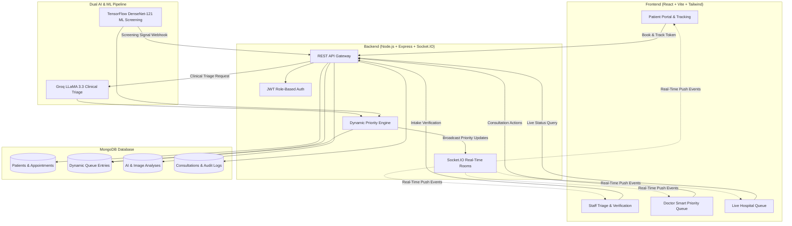

# Aarogya Pravah AI — AI-Powered Smart Patient Queue Management System

A production-grade, clinical-grade intelligent queue management system built for high-stakes hospital environments. **Aarogya Pravah AI** combines **Groq LLaMA 3.3 LLM clinical triage parsing**, **TensorFlow DenseNet-121 radiological image screening**, and a **dynamic multi-factor priority scoring engine** connected in real-time over **Socket.IO** with a specialized **React + Tailwind** healthcare dashboard.

---

## 🏛️ System Architecture



---

## 🚀 Key Features

1. **Patient Self-Check-in & Digital Token Generation**:
   - Fast appointment registration with structured symptoms, self-assessed severity, accidental trauma flag, and optional medical X-ray scan upload (`multipart/form-data`).
   - Instant token number generation (e.g. `EMG-20260822-4819`, `TKN-20260822-8022`).
2. **Privacy-Safe Real-Time Token Tracker**:
   - Patients track live queue position, estimated waiting time, and triage progression steps.
   - Strictly hides private medical notes and details of other waiting patients.
   - Real-time alerts when a doctor calls the token to proceed to a consultation room.
3. **Staff Triage & Human-in-the-Loop Verification**:
   - Real-time intake notification stream over Socket.IO (`join_staff`).
   - Staff review symptoms, inspect uploaded high-res X-rays in a lightbox viewer, adjust clinical severity (`CRITICAL`, `HIGH`, `MEDIUM`, `LOW`), request clarification, or verify check-in.
4. **Groq LLaMA 3.3 Clinical AI Triage**:
   - Zero-direct frontend exposure (API keys safely secured on backend).
   - Generates clinical urgency score, risk category, risk factors, and recommended priority level.
   - Intelligent fallback heuristics when Groq API is unavailable or unconfigured offline.
   - Stamped with non-diagnostic disclaimer: *"AI-generated decision support — not a medical diagnosis."*
5. **TensorFlow DenseNet-121 Radiological Image Screening**:
   - Standalone FastAPI Python service (`ML/`) with TensorFlow DenseNet-121 backbone and 2-stage transfer learning / fine-tuning pipeline.
   - Screening ingestion webhook (`POST /api/ai/image-analysis-result`) processing abnormality scores, confidence signals, and radiological findings.
   - Non-blocking asynchronous backend execution with automatic fallback to `ANALYSIS_PENDING`.
6. **Multi-Factor Dynamic Smart Priority Engine**:
   - Computes composite priority score transparently combining:
     $$\text{Priority Score} = S_{\text{Clinical}} + S_{\text{GroqUrgency}} + S_{\text{GroqRisk}} + S_{\text{DenseNetML}} + B_{\text{Trauma}} + W_{\text{WaitAging}}$$
   - Anti-starvation waiting time aging (+2 points per 10 minutes wait).
   - Priority boost (+35 points) for patients resuming from pending hold state.
7. **Doctor Clinical Dashboard & Consultation Workflow**:
   - Role-protected clinical dashboard (`DOCTOR`).
   - Live waiting queue automatically sorted by composite priority score.
   - Full patient clinical file displaying Groq AI insights and DenseNet ML radiological screening results side-by-side with disclaimers.
   - Doctor actions:
     - **Start Consultation**: Transitions status to `IN_CONSULTATION` and alerts patient over Socket.IO.
     - **Put On Hold (Pending Queue)**: Moves patient to `PENDING` with reason (e.g. sent for lab work / scan).
     - **Resume from Hold**: Restores patient to active queue with an immediate **+35 Priority Boost**.
     - **Complete Consultation**: Records clinical observations, diagnosis notes, vitals, prescriptions (Rx), and duration.
8. **Real-Time WebSockets Architecture**:
   - Room-based targeting (`staff`, `doctor`, `department:<dept>`, `patient:<tokenNumber>`).
   - Zero manual page reloads needed when new patients arrive, priorities change, or consultations complete.

---

## 📁 Repository Structure

```text
Aarogya Pravah AI/
├── backend/
│   ├── src/
│   │   ├── config/             # DB, Groq & Priority engine configuration
│   │   ├── controllers/        # Express route controllers (Auth, Patient, Staff, Doctor, Queue, AI)
│   │   ├── middleware/         # Auth JWT, Multer uploads, Error handling, Express validation
│   │   ├── models/             # Mongoose schemas (User, Patient, Appointment, QueueEntry, etc.)
│   │   ├── routes/             # REST API route definitions
│   │   ├── services/           # Groq AI, Priority scoring, Queue management, ML screening, Audit logs
│   │   ├── sockets/            # Socket.IO event handler & targeted emitter
│   │   ├── utils/              # Token generators, ApiResponse wrappers, Logger
│   │   ├── app.js              # Express application setup, CORS, security headers
│   │   └── server.js           # Server & Socket.IO initialization
│   ├── scripts/
│   │   ├── seed.js                         # Demo database seeder
│   │   ├── testQueueFlow.js                # Automated 14-step queue integration tests
│   │   ├── testGroqIntegration.js          # Groq AI triage & safe parser tests
│   │   ├── testPriorityAndSockets.js       # Dynamic priority & Socket.IO tests
│   │   ├── testMlBackendIntegration.js     # DenseNet ML screening backend tests
│   │   ├── testCombinedGroqMlPriority.js   # Dual Groq + ML priority combination tests
│   │   └── testEndToEndWorkflow.js         # Day 8 master end-to-end workflow test suite
│   ├── API_DOCUMENTATION.md    # Detailed backend API & Socket.IO specification
│   ├── package.json
│   └── .env.example
│
├── ML/
│   ├── app/
│   │   ├── main.py             # FastAPI entry point (/health, /predict, /predict-url)
│   │   ├── config.py           # ML service configuration
│   │   ├── model/              # TensorFlow DenseNet-121 backbone & inference
│   │   ├── training/           # 2-stage fine-tuning & evaluation scripts
│   │   └── schemas/            # Pydantic request/response schemas
│   ├── models/                 # Saved model weights (.weights.h5)
│   ├── requirements.txt
│   ├── .env.example
│   └── README.md
│
├── frontend/
│   ├── src/
│   │   ├── components/         # Navbar, Sidebar, ProtectedRoute, ImageModal, Loading
│   │   ├── context/            # AuthContext (JWT session & role checks)
│   │   ├── hooks/              # useAuth, useSocket
│   │   ├── pages/
│   │   │   ├── auth/           # Login, Register
│   │   │   ├── patient/        # PatientPortal, NewAppointment, TrackAppointment, TokenDetails
│   │   │   ├── staff/          # StaffDashboard, StaffValidation, StaffProfile
│   │   │   ├── doctor/         # DoctorDashboard, DoctorPatientDetails
│   │   │   └── shared/         # TriageQueue, PatientHistory, AIInsights, ResetPassword
│   │   ├── services/           # apiClient, authService, appointmentService, staffService,
│   │   │                       # doctorService, queueService, aiService, socketService
│   │   ├── App.jsx             # React Router route definitions
│   │   ├── main.jsx
│   │   └── index.css           # Tailwind custom clinical theme
│   ├── package.json
│   └── .env.example
│
└── README.md
```

---

## ⚙️ Environment Configuration

### Backend (`backend/.env`)

```ini
PORT=5000
NODE_ENV=development
MONGODB_URI=mongodb://127.0.0.1:27017/aarogya_pravah_ai
JWT_SECRET=super_secret_smart_queue_jwt_key_hackathon_2026_change_in_production
JWT_EXPIRES_IN=7d
GROQ_API_KEY=your_groq_api_key_here
GROQ_MODEL=llama-3.3-70b-versatile
ML_SERVICE_URL=http://localhost:8000
CLIENT_URL=http://localhost:5173
AVG_CONSULTATION_MINUTES=15
```

> *Note: If `GROQ_API_KEY` is not provided or set to a placeholder, the backend automatically engages intelligent clinical heuristic triage fallback so the system remains 100% operational offline.*

### ML Service (`ML/.env`)

```ini
PORT=8000
HOST=0.0.0.0
MODEL_VERSION=densenet121-tf-v1.0
CONFIDENCE_THRESHOLD=0.50
MODEL_WEIGHTS_PATH=app/models/densenet121_fine_tuned.weights.h5
```

### Frontend (`frontend/.env`)

```ini
VITE_API_URL=http://localhost:5000/api
VITE_SOCKET_URL=http://localhost:5000
```

---

## 🏃 Getting Started & Automated Testing

### 1. Prerequisites
- [Node.js](https://nodejs.org/) (v18 or higher)
- [Python](https://www.python.org/) (3.10+ with TensorFlow)
- [MongoDB](https://www.mongodb.com/) (running locally on port 27017 or MongoDB Atlas URI)

### 2. Run Automated Integration Test Suites

Run any of the 6 comprehensive automated test suites to verify end-to-end functionality:

```bash
# 1. Day 1 Queue & Auth Flow
node backend/scripts/testQueueFlow.js

# 2. Day 2 Groq AI Clinical Triage & Safe Parser
node backend/scripts/testGroqIntegration.js

# 3. Day 3 Dynamic Priority & Multi-Room Socket.IO
node backend/scripts/testPriorityAndSockets.js

# 4. Day 6 DenseNet ML Service & Backend Integration
node backend/scripts/testMlBackendIntegration.js

# 5. Day 7 Dual Groq + ML Multi-Factor Priority Engine
node backend/scripts/testCombinedGroqMlPriority.js

# 6. Day 8 Master End-to-End Workflow Verification Suite
node backend/scripts/testEndToEndWorkflow.js
```

### 3. Backend Setup

```bash
cd backend
npm install

# Seed demo users & sample patients
npm run seed

# Start backend server
npm run dev
```
*Backend runs on `http://localhost:5000`.*

### 4. ML Service Setup (Optional)

```bash
cd ML
pip install -r requirements.txt

# Start FastAPI TensorFlow ML Service
uvicorn app.main:app --port 8000 --reload
```
*ML Service runs on `http://localhost:8000`.*

### 5. Frontend Setup

```bash
cd frontend
npm install

# Start Vite development server
npm run dev
```
*Frontend runs on `http://localhost:5173`.*

---

## 🔑 Default Seeded Demo Accounts

When you run `npm run seed` in `backend/`, the following pre-configured demo accounts are available:

| Role | Email | Password | Department |
|---|---|---|---|
| **Hospital Staff** | `staff@aarogyapravah.ai` | `password123` | Emergency & Triage |
| **Doctor (Emergency)** | `dr.mehta@aarogyapravah.ai` | `password123` | Emergency |
| **Doctor (Pulmonology)** | `dr.roy@aarogyapravah.ai` | `password123` | Pulmonology |

---

## 🧪 Complete End-to-End Demo Workflow

1. **Patient Booking**:
   - Open `http://localhost:5173/`.
   - Fill in patient details (e.g. name: *Aarav Sharma*, age: 52, symptoms: *High fever, cough with sputum, shortness of breath*, department: *Pulmonology*, severity: *High*, attach X-ray scan).
   - Click **Generate Token**. Note the generated token number (e.g. `TKN-20260928-7832`).
2. **Patient Live Tracking**:
   - Navigate to **Track Appointment** (`/track-appointment`).
   - Enter token number to see real-time queue position and status progression.
3. **Staff Verification & Groq AI Triage**:
   - Open a new tab and navigate to `/login` (or `/staff/login`).
   - Log in as `staff@aarogyapravah.ai` / `password123`.
   - On the **Validation Queue**, click the new patient arrival.
   - Review reported symptoms, inspect the uploaded X-ray in full-screen lightbox, select clinical severity (`HIGH`), and click **Verify & Trigger AI Triage**.
   - Groq AI triage runs automatically and places the patient into the smart priority queue.
4. **DenseNet ML Radiological Screening**:
   - Asynchronous ML screening processes the X-ray scan and updates the patient's record with abnormality score and findings.
   - Priority engine dynamically recalculates the composite priority score (+27 pts for detected abnormality).
5. **Doctor Consultation**:
   - In another window, log in as `dr.roy@aarogyapravah.ai` / `password123`.
   - Open **Doctor Dashboard** (`/doctor/dashboard`).
   - Observe the real-time priority queue sorted by composite priority score.
   - Inspect dual AI insights (Groq AI Clinical Triage + TensorFlow DenseNet ML Screening).
   - Click **Start Consultation** to start consultation (patient tracker immediately updates to *In Consultation*).
   - Enter diagnosis notes, vitals, prescriptions, and click **Complete Visit**.
6. **Pending Queue & Resume Boost**:
   - On Doctor Dashboard, click the **Hold** button on a patient to put them on hold (e.g. *Awaiting lab results*).
   - Switch to the **Pending / On Hold** tab.
   - Click **Resume (+35 Boost)**. Observe patient returned to the top of the waiting queue with restored priority boost.

---

## 🔒 Safety & Non-Diagnostic Disclaimer

Aarogya Pravah AI is designed strictly as a **clinical decision support and queue optimization platform**. It does **NOT** provide a binding medical diagnosis, replace licensed medical practitioners, or make autonomous medical decisions. All clinical intake records require verification by qualified hospital staff before placement in consultation queues.

---

## 📄 License
MIT License. Developed for hackathon demonstration.